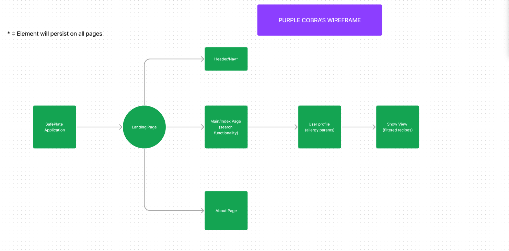

# SafePlate Application

## Overview

SafePlate is an innovative web application designed to enhance the dining experience for individuals with dietary restrictions. Leveraging the power of React and modern web technologies, SafePlate offers personalized recipe recommendations, taking into account users' dietary preferences and allergies. The application aims to simplify meal planning and ensure a safe, enjoyable eating experience for everyone.

## SafePlate Web Application

Explore the SafePlate web application and test it yourself:

[SafePlate Web Application](https://main--benevolent-beignet-31f50d.netlify.app)

Feel free to navigate through our platform and discover the features designed for your convenience.

## Features

- **Explore Recipes**: Dive into a diverse collection of recipes, each with detailed information including ingredients, preparation instructions, and nutritional content.
- **Search Bar Functionality **: Users can search for recipe's with their allergy filters kept in mind. 
- **Personalized User Profiles**: Customize your profile with dietary needs, allergies, and favorite recipes to receive tailored recipe suggestions. The application allows for the creation of new user profiles through a user-friendly form, capturing essential information for a personalized experience.
- **User Creation**: Facilitates the addition of new users through a simple form, enhancing the application's accessibility and user engagement.
- **Weekly Meal Planning**: Efficiently plan your meals for the week with an easy-to-use interface, adding/removing recipes to each day for breakfast, lunch, and dinner.
- **Dietary Filtering**: The application intelligently filters out recipes containing allergens or ingredients you wish to avoid, offering only safe and suitable options.
- **Favorites Management**: Save your top recipes to your favorites for quick and easy access anytime.

## Technology Stack

- **Frontend**: Developed with React.js, utilizing functional components and hooks for state management, and React Router for seamless navigation.
- **CSS**: Stylish and responsive design ensuring an engaging user experience across devices.
- **API Integration**: Connects to a custom backend via the Fetch API, handling data retrieval and updates for recipes, user profiles, and meal plans.


## Getting Started Locally

Follow these steps to get the SafePlate application running on your local machine.

### Prerequisites

- Node.js and npm installed on your machine.

### Installation

1. **Clone the repository**

    ```sh
    git clone <repository-url>
    cd safeplate
    ```

2. **Install NPM packages**

    ```sh
    npm install
    ```

3. **Environment Configuration**

    Create a `.env` file in the root directory and add your backend API URL:

    ```plaintext
    VITE_BASE_API_URL=https://yourapi.url
    ```

4. **Start the Application**

    ```sh
    npm start
    ```

    The application will be available at `http://localhost:3000`.

## User Stories

**Explore Recipes**
As a user with dietary restrictions, I want to easily explore a variety of recipes so that I can find safe and delicious meal options.

**Search Bar Functionality**
As a user, I want to use the search bar functionality to quickly find recipes that align with my specific allergy filters.

**Personalized User Profiles**
As a new user, I want to create a personalized profile by providing my dietary needs and allergies to receive tailored recipe suggestions.

**Weekly Meal Planning**
As a user, I want to efficiently plan my meals for the week using an intuitive interface, adding and removing recipes for breakfast, lunch, and dinner.

**User Creation**
As a new user, I want a simple and user-friendly form to facilitate the creation of my profile, enhancing the accessibility and engagement of the application.

**Dietary Filtering**
As a user, I want the application to intelligently filter out recipes containing allergens or ingredients I wish to avoid, ensuring that I only see safe and suitable options.

## WireFrames
Initial WireFrame


Updated WireFrame
